# Matheus Freire

### Backend Engineer | Cloud & Infrastructure

I build backend systems and production-oriented infrastructure using Python, FastAPI, PostgreSQL, Docker, Linux, and AWS.

My work focuses on reliable APIs, asynchronous processing, observability, security, and cloud-native architecture.

## Technology Stack

**Backend and data**

  
  
  
  
  

**Cloud and infrastructure**

  
  
  
  
  

**Observability**

  
  
  

> **Current focus:** building production-oriented services with **Go**, advancing in **AWS**, and deepening CI/CD, security, and distributed systems expertise.

## Featured Projects

### [Relay](https://github.com/Matheus-TecDev/Relay)

Event-driven processing platform with Transactional Outbox, RabbitMQ domain workers, progressive retries, DLQ operations, idempotent consumers, distributed tracing, centralized logs, metrics, and alerting.

`FastAPI` · `RabbitMQ` · `PostgreSQL` · `Redis` · `OpenTelemetry` · `Prometheus` · `Grafana`

### [Sentinel](https://github.com/Matheus-TecDev/Sentinel)

Full-stack monitoring platform for APIs and internal services with scheduled health checks, incident tracking, webhook notifications, RBAC, metrics, and centralized logs.

`FastAPI` · `PostgreSQL` · `APScheduler` · `Docker` · `Prometheus` · `Grafana` · `Loki`

### [TicketOps](https://github.com/Matheus-TecDev/TicketOps)

Internal service desk platform with role-based ticket workflows, audit trails, comments, attachments, operational dashboards, automated tests, and containerized infrastructure.

`FastAPI` · `PostgreSQL` · `React` · `Docker` · `Nginx` · `GitHub Actions`

## GitHub Activity

  

## Contact

  
  
  

